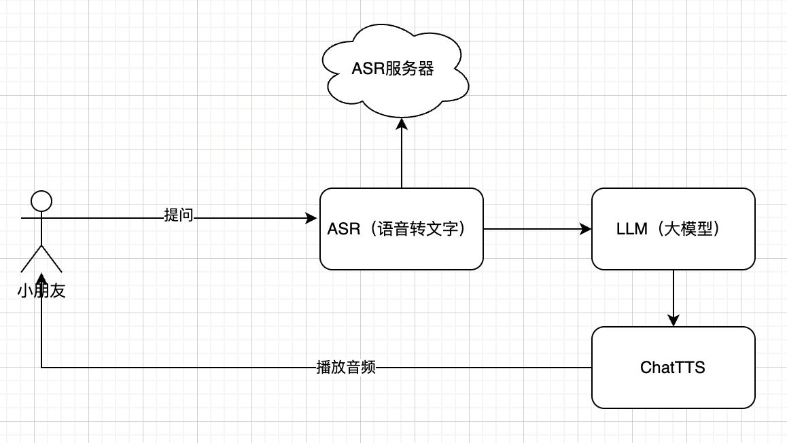

# 儿童诗歌助理

## 项目介绍

儿童诗歌助理是一个基于自然语言处理技术的儿童诗歌创作助手，可以根据用户输入的关键词，生成符合儿童阅读习惯的诗歌。

本项目集成了大模型Qwen-7b-chat，可以生成更加丰富的诗歌内容。

文字转语音chatTTS，可以将生成的诗歌内容转换为语音，提供更加丰富的体验。

## 方案选择

 - CPU型号：Intel(R) Xeon(R) Platinum 8358P CPU @ 2.60GHz

 - 部署方案：vllm-0.4.3-CPU  / triton-server-LLM CPU

 - 模型：Qwen1.5-7b-chat Int4量化 或者 Qwen-1_8B-Chat

## 架构方案

## 大模型部署方案

- intel依赖库: `xtransformer`

- 部署框架: `vllm-0.4.3-CPU`，参考链接：https://docs.vllm.ai/en/stable/getting_started/cpu-installation.html

## 总结

本项目主要探讨大模型在CPU(intel)上的运行可行性。但目前intel的依赖库`xtransformer`还不够完善，部署过程中遇到了一些问题，需要进一步完善。

目前部署方案仍采用vllm cpu版本。

同时，本项目附上intel方案部署的所有notebook,包含所有的错误，供大家参考。